# Stratoview Whitelabel Lombardia - Complete Architecture Documentation

**CONVERSATION LABEL:** Stratoview Whitelabel Lombardia Architecture Analysis  
**DOCUMENT VERSION:** 0.6  
**LAST UPDATED:** June 23, 2025

## Project Overview

**Stratoview Whitelabel Lombardia** is a SaaS platform designed as a repository of content oriented to foresight and strategic design making practices. The platform serves as a comprehensive intelligence system that combines data analysis, visualization, and collaborative strategic planning tools.

### Core Product Concept

Stratoview Whitelabel Lombardia functions as a content management and visualization platform where users can:

- Access and analyze **4 distinct content types**: Indexes, Scenarios, Trend Radar, and Participatory Data
- Create **Projects** that display up to 4 pieces of content simultaneously in customizable layouts
- Browse and discover content through **dual content discovery system** (project-focused + personal content management)
- Generate private user content alongside accessing company-produced intelligence
- Manage individual **ContentBlock controls** with enhanced interaction capabilities

### Key Product Features

**Content Types:**

- **Indexes**: Core analytical/predictive data with multiple visualization modes (Map, Index, DataViz views) accessible via tabs
- **Scenarios**: Text-based strategic scenarios with probability assessments
- **Trend Radar**: Visual radar representations of emerging trends
- **Participatory Data**: Data visualizations of polls and other research activities to gather quantitative feedback from communities around specific topics

**Enhanced Project Management:**

- Up to 4 ContentBlocks per project displaying any mix of content types
- 2 layout modes: Grid View (2x2), Columns View (side-by-side)
- **Individual ContentBlock single view**: Any ContentBlock can expand to full workspace
- **Add Content functionality**: Direct access to Content Browser from project toolbar
- **Project state management**: Empty state vs Active state based on ContentBlock presence
- Persistent state saving for layout preferences, ContentBlock view modes, and individual configurations

**Dual Content Discovery System:**

- **Content Browser (Screen 5)**: Public + Private content for project building with "Add to Project" + "Details" CTAs (accessible from Project Workspace)
- **Personal Content Browser (Screen 7)**: Private content library management with "Edit Content" + "Details" CTAs (accessible from Home Dashboard)
- **Content Detail Modal**: Unified detailed information display with comprehensive metadata
- **Context-aware CTAs**: Different actions based on content ownership and user intent

**Enhanced ContentBlock Management:**

- **Individual ContentBlock Controls**: Info modal, single view toggle, removal from project
- **Index View Tabs**: Map | Index | DataViz tabs for Index ContentBlocks (replaces switch button)
- **ContentBlock State Persistence**: Individual view modes and configurations persist across sessions
- **Info Modal System**: Comprehensive content metadata with Intelligence Area, Topic Area, tags, coverage, and Details CTA

**Visualization Capabilities:**

- **MapView**: Mapbox integration with H3 grid system for geospatial data
- **IndexView**: Structured data presentations
- **DataVizView**: Interactive charts and visualizations
- Geographic search and filtering capabilities

## Master Architecture - Level 1 (Corrected)


## Entity Relationship Diagram


## User Permissions & Access Control Architecture


### Permission System Overview

[Spiegazione concisa del sistema]

_For detailed permission specifications and conditional access workflows, see [user-roles-documentation.md](./user-roles)_

## System Architecture Diagram


## Technical Architecture Details

### Data Model Key Relationships

**Enhanced Projects & ContentBlocks:**

- Each Project can contain 0-4 ContentBlocks with **project state management** (Empty/Active)
- ContentBlocks act as UI containers with **individual control capabilities**
- **Individual single view**: Any ContentBlock can expand to full workspace while hiding others
- Same content can appear in multiple projects/ContentBlocks (many-to-many relationship)
- Projects maintain layout state (`saved_layout_mode`) and **individual ContentBlock states**
- **Add Content functionality**: Projects have direct access to Content Browser for content addition

**Enhanced Content Types & Specialization:**

- Base `Content` entity with common metadata and **content ownership tracking**
- 4 specialized content types extend the base: Index, Scenario, TrendRadar, ParticipatoryData
- **Index content supports tabbed view switching** (Map | Index | DataViz tabs)
- Content visibility controls access with **dual discovery system** (public company content vs private user content)
- **Content source attribution**: Company-generated vs user-created content tracking

**Enhanced Metadata & Taxonomy:**

- **Intelligence Area**: Single research domain classification per content
- **Topic Area**: Single subject area classification per content
- **Themes**: Multiple tag-based categorization for cross-domain grouping
- **Geographic Coverage**: Spatial scope metadata for geographic filtering
- **Geographic Resolution**: Spatial granularity for Index content (provinces, 5km, etc.)
- **Content Detail Modal**: Unified metadata display system across all contexts

### User Experience Flow

## Overview

The Stratoview user experience is built around **dual content discovery patterns**, **enhanced project management**, and **individual ContentBlock control systems**. User flows adapt dynamically based on **content ownership**, **project state**, and **user intent context**.

**Main Navigation Paths Enhanced:**

1. **Login** → **Home** → **Personal Content Browser** → **Edit Content** → **Content Editor**
2. **Login** → **Home** → **Projects List** → **Project Container** → **Content Browser** → **Add to Project**
3. **Login** → **Home** → **Projects List** → **Existing Project** → **Project Container** (Active/Empty State)
4. **Login** → **Home** → **Personal Content Browser** → **Content Details** → **Content Detail Modal**
5. **Login** → **Home** → **Content Editor** → **New Content** → **Content Creation**

**Enhanced Project Interaction:**

- Users access projects from Projects List with **dual project states**
- **Empty Projects**: Show empty state with "Browse Content" CTA leading to Content Browser
- **Active Projects**: Display ContentBlocks in configurable layouts (Grid/Columns only)
- **Add Content**: Project toolbar CTA leads to Content Browser for project content addition
- **Individual ContentBlock Management**: Info modal, single view toggle, removal from project
- **ContentBlock state persistence**: Individual view modes and configurations maintained across sessions

**Dual Content Discovery System:**

- **Content Browser (Screen 5)**: Accessible from Project Container → Public company + Private user content → "Add to Project" + "Details" CTAs
- **Personal Content Browser (Screen 7)**: Accessible from Home Dashboard → Private user content exclusively → "Edit Content" + "Details" CTAs
- **Content Detail Modal**: Comprehensive metadata display with Intelligence Area, Topic Area, tags, geographic coverage
- **Context-aware CTAs**: Different actions based on content ownership and user access context
- Advanced search and filtering with **context-appropriate filtering options**

## Primary User Journeys Overview

_This overview diagram shows all main user pathways through the application, organized by functional areas (Project Management, Personal Content, Content Discovery, Workspace Interactions) to provide stakeholders with a clear understanding of user flow architecture._

```mermaid
graph TB
    %% Entry Points
    START[👤 User Access]
    LOGIN[🔐 Login Screen]

    %% Main Hub
    HOME[🏠 Home Dashboard]

    %% Primary Navigation Paths
    subgraph "📁 Project Management Journey"
        PROJ_LIST[Projects List]
        NEW_PROJECT[Create New Project]
        EXISTING_PROJECT[Open Existing Project]

        subgraph "🏗️ Project States"
            EMPTY_PROJECT[Empty Project State]
            ACTIVE_PROJECT[Active Project State]
        end

        subgraph "📦 Content Addition Flow"
            ADD_CONTENT_CTA[Add Content CTA]
            CONTENT_BROWSER[Content Browser]
            ADD_TO_PROJECT[Add to Project Action]
            PROJECT_UPDATED[Project State Updated]
        end
    end

    %% Personal Content Journey
    subgraph "👤 Personal Content Journey"
        PERSONAL_BROWSER[Personal Content Browser]
        CONTENT_EDITOR[Content Editor]

        subgraph "✏️ Content Creation Flow"
            NEW_CONTENT[Create New Content]
            EDIT_CONTENT[Edit Existing Content]
            SAVE_CONTENT[Save Content]
            CONTENT_LIBRARY[Personal Library Updated]
        end
    end

    %% Content Detail Journey
    subgraph "🔍 Content Discovery Journey"
        CONTENT_DETAIL[Content Detail Modal]

        subgraph "🎯 Context-Aware Actions"
            PUBLIC_ACTIONS[Public Content Actions]
            PRIVATE_ACTIONS[Private Content Actions]
            PROJECT_ACTIONS[Project Context Actions]
        end
    end

    %% Enhanced Project Interactions
    subgraph "🎛️ Project Workspace Interactions"
        LAYOUT_SWITCH[Layout Mode Switch]
        CONTENTBLOCK_INFO[ContentBlock Info]
        SINGLE_VIEW[Individual Single View]
        REMOVE_CONTENT[Remove from Project]
    end

    %% Primary Flow
    START --> LOGIN
    LOGIN --> HOME

    %% Project Management Flow
    HOME --> PROJ_LIST
    PROJ_LIST --> NEW_PROJECT
    PROJ_LIST --> EXISTING_PROJECT

    NEW_PROJECT --> EMPTY_PROJECT
    EXISTING_PROJECT --> ACTIVE_PROJECT
    EXISTING_PROJECT --> EMPTY_PROJECT

    EMPTY_PROJECT --> ADD_CONTENT_CTA
    ACTIVE_PROJECT --> ADD_CONTENT_CTA

    ADD_CONTENT_CTA --> CONTENT_BROWSER
    CONTENT_BROWSER --> ADD_TO_PROJECT
    ADD_TO_PROJECT --> PROJECT_UPDATED
    PROJECT_UPDATED --> ACTIVE_PROJECT

    %% Personal Content Flow
    HOME --> PERSONAL_BROWSER
    HOME --> CONTENT_EDITOR

    PERSONAL_BROWSER --> EDIT_CONTENT
    CONTENT_EDITOR --> NEW_CONTENT

    NEW_CONTENT --> SAVE_CONTENT
    EDIT_CONTENT --> SAVE_CONTENT
    SAVE_CONTENT --> CONTENT_LIBRARY
    CONTENT_LIBRARY --> PERSONAL_BROWSER

    %% Content Detail Flow
    CONTENT_BROWSER --> CONTENT_DETAIL
    PERSONAL_BROWSER --> CONTENT_DETAIL
    CONTENTBLOCK_INFO --> CONTENT_DETAIL

    CONTENT_DETAIL --> PUBLIC_ACTIONS
    CONTENT_DETAIL --> PRIVATE_ACTIONS
    CONTENT_DETAIL --> PROJECT_ACTIONS

    %% Project Workspace Interactions
    ACTIVE_PROJECT --> LAYOUT_SWITCH
    ACTIVE_PROJECT --> CONTENTBLOCK_INFO
    ACTIVE_PROJECT --> SINGLE_VIEW
    ACTIVE_PROJECT --> REMOVE_CONTENT

    REMOVE_CONTENT --> ACTIVE_PROJECT
    REMOVE_CONTENT --> EMPTY_PROJECT

    %% Styling
    classDef entry fill:#E8F5E8,stroke:#2E7D32,stroke-width:3px,color:#000
    classDef primary fill:#E3F2FD,stroke:#1565C0,stroke-width:3px,color:#000
    classDef content fill:#FFF3E0,stroke:#EF6C00,stroke-width:3px,color:#000
    classDef action fill:#FCE4EC,stroke:#AD1457,stroke-width:2px,color:#000
    classDef detail fill:#F3E5F5,stroke:#7B1FA2,stroke-width:2px,color:#000

    class START,LOGIN entry
    class HOME,PROJ_LIST,NEW_PROJECT,EXISTING_PROJECT,EMPTY_PROJECT,ACTIVE_PROJECT primary
    class PERSONAL_BROWSER,CONTENT_EDITOR,CONTENT_BROWSER,NEW_CONTENT,EDIT_CONTENT content
    class ADD_CONTENT_CTA,ADD_TO_PROJECT,SAVE_CONTENT,LAYOUT_SWITCH,SINGLE_VIEW,REMOVE_CONTENT action
    class CONTENT_DETAIL,PUBLIC_ACTIONS,PRIVATE_ACTIONS,PROJECT_ACTIONS,CONTENTBLOCK_INFO detail
```



## Detailed User Pathways

### 1. Project Building Journey

**Path 1A: Empty Project → Active Project**

_This state diagram illustrates the transition from an empty project to an active project through content addition, showing the UI states and user interactions involved._

```mermaid
stateDiagram-v2
    [*] --> EmptyProject: Create New Project
    EmptyProject --> ContentBrowser: "Browse Content" CTA
    ContentBrowser --> FilteringContent: Apply Filters
    FilteringContent --> ContentFound: Discover Content
    ContentFound --> AddToProject: "Add to Project" CTA
    AddToProject --> ActiveProject: ContentBlock Created
    ActiveProject --> [*]: Project Ready

    note right of EmptyProject
        • Empty state display
        • Project toolbar with disabled layout controls
        • Single "Browse Content" CTA
        • Project info: "Empty workspace ready for content"
    end note

    note right of ActiveProject
        • Layout controls enabled (Grid/Columns)
        • "Add Content" CTA in toolbar
        • Individual ContentBlock controls visible
        • Project state: "Active"
    end note
```



**Path 1B: Active Project → Enhanced Management**

_This state diagram demonstrates the enhanced project management capabilities, including individual ContentBlock controls, layout switching, and content detail access within active projects._

```mermaid
stateDiagram-v2
    [*] --> ActiveProject: Open Existing Project
    ActiveProject --> ContentBlockAction: User Interaction

    ContentBlockAction --> InfoModal: Info Button
    ContentBlockAction --> SingleView: Single View Toggle
    ContentBlockAction --> RemoveBlock: Remove Button
    ContentBlockAction --> LayoutChange: Grid to Columns
    ContentBlockAction --> AddMore: "Add Content" CTA

    InfoModal --> DetailModal: "View Details"
    SingleView --> IndexTabs: Switch Views (Index Content)
    IndexTabs --> SingleView: Tab Selection
    RemoveBlock --> ActiveProject: ContentBlock Removed
    RemoveBlock --> EmptyProject: Last ContentBlock Removed
    LayoutChange --> ActiveProject: Layout Updated
    AddMore --> ContentBrowser: Browse for More Content
    ContentBrowser --> ActiveProject: Content Added

    DetailModal --> EditContent: "Edit Content" (if Owned)
    DetailModal --> ActiveProject: "Close"

    note right of SingleView
        • Selected ContentBlock expands to full workspace
        • Other ContentBlocks hidden but states preserved
        • Exit single view returns to current layout
        • Index Content: Map/Index/DataViz tabs available
    end note
```



### 2. Dual Content Discovery Journey

**Path 2A: Content Browser (Project-Focused)**

_This flowchart shows the Content Browser accessed from projects, where users can browse both public company content and private user content together in a unified interface for adding to projects._


**Path 2B: Personal Content Browser (Management-Focused)**

_This flowchart illustrates the Personal Content Browser workflow, focused on managing private user content with editing capabilities and multiple save options._


## State Transition Documentation

### Project State Management

**Project State Definitions:**

_This state diagram defines the two main project states (Empty/Active) and their associated UI elements and user capabilities._

```mermaid
stateDiagram-v2
    [*] --> EmptyProject: New Project Created
    EmptyProject --> ActiveProject: First ContentBlock Added
    ActiveProject --> EmptyProject: Last ContentBlock Removed
    ActiveProject --> ActiveProject: ContentBlock Added/Removed (1-4 remain)

    state EmptyProject {
        [*] --> NoContentBlocks: 0 ContentBlocks
        NoContentBlocks --> EmptyStateDisplay: UI State
        EmptyStateDisplay --> BrowseContentCTA: User Action Available
    }

    state ActiveProject {
        [*] --> HasContentBlocks: 1-4 ContentBlocks Present
        HasContentBlocks --> LayoutEnabled: Grid/Columns Available
        LayoutEnabled --> IndividualControls: ContentBlock Management
        IndividualControls --> StateePersistence: User Interactions Saved
    }

    note right of EmptyProject
        UI Elements:
        • Empty state illustration
        • "Browse Content" CTA
        • Project info display
        • Layout controls hidden
        • Toolbar minimal
    end note

    note right of ActiveProject
        UI Elements:
        • ContentBlock grid/columns
        • Layout toggle controls
        • "Add Content" CTA
        • Individual ContentBlock controls
        • State persistence active
    end note
```



### ContentBlock Individual States

**ContentBlock State Transitions:**

_This state diagram shows how individual ContentBlocks transition between different view modes (Default, Single View, Info Modal) and the available features in each state._

```mermaid
stateDiagram-v2
    [*] --> DefaultView: ContentBlock Added to Project
    DefaultView --> SingleView: Single View Toggle
    SingleView --> DefaultView: Exit Single View

    DefaultView --> InfoModal: Info Button Clicked
    SingleView --> InfoModal: Info Button Clicked
    InfoModal --> DefaultView: Modal Closed
    InfoModal --> SingleView: Modal Closed (if was in SingleView)

    state SingleView {
        [*] --> ExpandedView: ContentBlock Fills Workspace
        ExpandedView --> IndexTabs: Index Content Only
        IndexTabs --> MapView: Map Tab Selected
        IndexTabs --> IndexView: Index Tab Selected
        IndexTabs --> DataVizView: DataViz Tab Selected
        MapView --> IndexTabs: Tab Switch
        IndexView --> IndexTabs: Tab Switch
        DataVizView --> IndexTabs: Tab Switch
    }

    DefaultView --> Removed: Remove Button
    SingleView --> Removed: Remove Button
    Removed --> [*]: ContentBlock Deleted

    note right of SingleView
        Features Available:
        • Full workspace occupation
        • Other ContentBlocks hidden
        • Index view tabs (if Index content)
        • Info modal access maintained
        • Remove capability maintained
    end note
```



### Content Detail Modal States

**Modal Context Management:**

_This state diagram shows how the unified Content Detail Modal adapts its CTAs and content based on the context from which it was accessed (Content Browser, Personal Browser, or ContentBlock Info)._


## Navigation Decision Points

### Context-Aware Action Matrix

**User Action Decision Tree:**

_This decision flowchart illustrates how the system determines which CTAs to show based on content ownership (user-owned vs company content) and current user context (Personal Browser, Content Browser, or ContentBlock Info)._


### Enhanced ContentBlock Management Decision Flow

**ContentBlock Interaction Decision Matrix:**

_This comprehensive flowchart maps all possible ContentBlock interactions (Info, Single View, Remove, Index Tabs) and their resulting system behaviors and state changes._


## Mobile User Experience Adaptations

### Mobile Navigation Flow

_This flowchart shows how the desktop user flows adapt to mobile interfaces, with vertical ContentBlock stacking, touch interactions, and mobile-specific UI patterns._


## Performance and State Management

### State Persistence Strategy

```
ContentBlock State Storage:
├── Individual ContentBlock States
│   ├── View mode preference (MapView/IndexView/DataVizView)
│   ├── Single view activation status
│   ├── Position in project layout
│   └── Last interaction timestamp
├── Project-Level States
│   ├── Active layout mode (Grid/Columns)
│   ├── ContentBlock arrangement
│   ├── Project state classification (Empty/Active)
│   └── Last modified timestamp
└── User Session States
    ├── Last visited project
    ├── Content browser filter preferences
    └── Personal browser organization preferences
```

### Technical Implementation Notes

**Modal Interaction Tracking**: _For advanced implementations, consider tracking which modals users access most frequently and from which contexts to optimize UI patterns and predict user needs._

**Navigation State Management**: _Advanced features like deep linking to specific ContentBlocks, browser back/forward support for modal states, and connection loss recovery can enhance user experience but add complexity to state management architecture._

## Technical Implementation Notes

### Enhanced Frontend Architecture

- **UI Layer**: React-based interfaces for all user-facing screens + Content Detail Modal
- **Dual Content Discovery**: Context-specific content browsers for project building vs content management
- **Enhanced Project Management**: Dynamic layout system with individual ContentBlock controls
- **ContentBlock Individual Control System**: Reusable components with persistent state management and individual interaction capabilities
- **Content Detail Modal**: Unified detailed content information display with context-aware CTAs

### Enhanced Backend Architecture

- **Content Repository**: Centralized content management with access control and **content ownership tracking**
- **Taxonomy System**: Hierarchical categorization system for content organization
- **Enhanced Visualization Engine**: Multiple rendering modes for Index content with **tabbed view switching**
- **Geographic Services**: Integration with Mapbox and H3 grid system
- **State Persistence System**: Individual ContentBlock states and project configuration storage

### Data Infrastructure Enhanced

- **Geospatial Database**: NoSQL storage for geographic and visualization data
- **Content Metadata**: Structured storage for taxonomy, content relationships, and **content ownership**
- **State Storage**: ContentBlock individual states, project configurations, and user preferences
- **External Services**: Mapbox for mapping, H3 for spatial indexing
- **Content Detail System**: Unified content information storage for modal display

## Version History

### v0.6 (2025-06-23)

- Integrated User Permissions & Access Control Architecture
- Added detailed permission matrices and conditional access patterns

### v0.5 (2025-06-23)

- Complete User Experience Flow integration
- Dual content discovery system
- Individual ContentBlock management

### v0.4 (2025-06-18)

- Initial complete architecture with ERD
- System architecture diagrams
- Technical implementation notes

## Migration Information for New Conversations

### Key Decisions Made

1. **ContentBlock Individual Controls**: Enhanced granular control over ContentBlocks with info modal, single view, and removal capabilities
2. **Dual Content Discovery Strategy**: Separate browsers for project building vs personal content management
3. **Project state management**: Empty vs Active states based on ContentBlock presence with appropriate CTAs
4. **Index View Tabs**: Replaced switch button with tabbed interface (Map | Index | DataViz)
5. **Content ownership recognition**: Tracking and context-aware CTAs based on content source
6. **Individual Single View**: Any ContentBlock can expand independently of layout mode
7. **Navigation flow correction**: Content Browser accessible from Project, Personal Browser from Home
8. **Geographic search logic**: Filters by content metadata, not visualization data
9. **Enhanced mobile responsive**: ContentBlock vertical stacking with adapted controls

### Outstanding Design Questions

1. **Cross-ContentBlock interactions**: Should ContentBlocks be able to interact with each other in advanced scenarios?
2. **Personal content sharing**: Future capability for sharing personal content between users in same organization?
3. **Advanced ContentBlock features**: Additional controls beyond current set (e.g., minimize, duplicate, advanced filtering)?
4. **Content Detail Modal extensions**: Integration with external data sources for enhanced content information?

### Progressive Enhancement Pipeline

**Phase 1: Master Architecture (COMPLETED)**

- ✅ Simplified master architecture with corrected navigation flows
- ✅ Dual content discovery system properly represented
- ✅ ContentBlock individual controls integration
- ✅ Foundation for detailed phases

**Phase 2: User Journey Flow Implementation (COMPLETED)**

- ✅ **Purpose**: Detailed user pathways with state transitions
- ✅ **Content**: Project workspace interactions, dual content discovery flows, context-aware actions
- ✅ **Deliverable**: Complete User Experience Flow section with Primary User Journeys Overview, Detailed Pathways (4), State Transition Documentation (3), Navigation Decision Points (2), Mobile Adaptations
- ✅ **Target**: UX implementation teams and developers

**Phase 3: Component Architecture Development (NEXT)**

- **Purpose**: Technical component hierarchy for development teams
- **Content**: Component relationships, ContentBlock individual controls, TypeScript interfaces
- **Target**: Development teams and sprint planning

**Phase 4: Index Visualizations Technical Detail**

- **Purpose**: Data layer implementation specifics
- **Content**: 3-layer map architecture, performance optimization, H3 integration
- **Target**: Technical implementation and performance optimization

### Related Documentation Available

- Original Stratoview Whitelabel Lombardia diagrams (object mapping and user flow PDFs)
- Stratoview project analysis (`stratoview_knowledgebase.md`) for related geospatial intelligence concepts
- Enhanced user roles and permissions documentation for implementation guidance
- Progressive disclosure strategy documentation for architectural approach

---

**For Developers:** Use the Master Architecture for high-level understanding, ERD for database schema design, and System Architecture for detailed component relationships including individual ContentBlock management and corrected navigation flows.

**For AI Screen Generation:** The Master and System Architecture provide enhanced component hierarchy and data relationships for generating contextually appropriate interfaces with dual content discovery and individual ContentBlock controls.

**Next Steps:** Proceed with Progressive Enhancement Phases 2-4 to complete detailed implementation documentation for development teams and AI code generation.

**Document Status:** READY FOR PHASE 3 - Component Architecture Development
